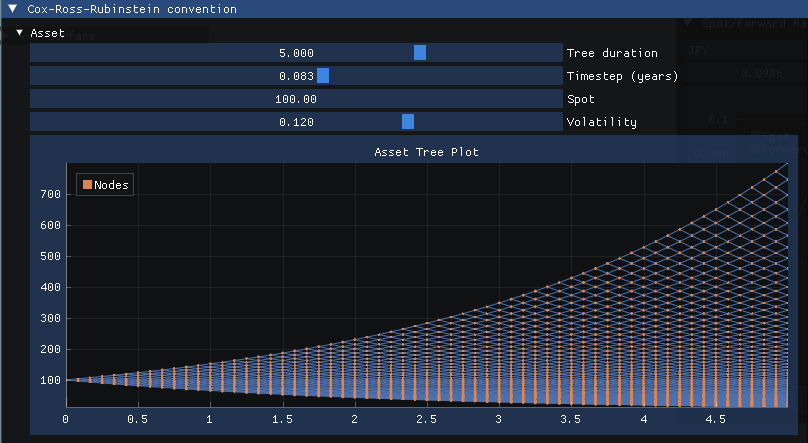
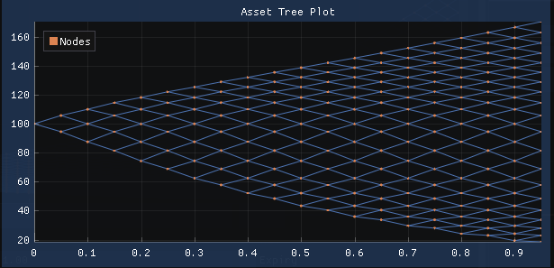

## Overview

This library is intended to enable to build effective tools for developing deeper intuition into the details of tree-based construction and pricing of derivative securities, and is suitable for both seasoned professionals and students of quantitative finance.

Because this is not intended for production use, some details are omitted. For example, there is no support for country-specific holiday calendars or details about exchange-traded contract specs.

### Features

* **Tree-based models:** Implements binomial trees for accurate derivative pricing.
* **Volatility Modeling:** Supports constant, term structure, and local volatility surfaces.
* **Option Pricing:** Prices European and American options on assets and currencies.
* **Visualization:** Provides tools for visualizing tree structures and probability distributions.

### Roadmap / wish list

* Implement short-rate models with calibration for interest-rate derivatives.
* Add support for trinomial trees for easier calibration.
* Improve visualisation capabilities for vol surfaces and interest rate curves. 


### Getting started
Install [Bazel](https://bazel.build/install) and then run:
```shell
# Launch the interactive GUI!
bazel run explorer

# Or just run all the unit tests.
bazel test ...
```

This library works on MacOS and Linux. (Windows is not yet supported because of the use of GLFW, which was recently added to the BCR without Windows support. See the [Bazel build rule here](https://github.com/bazelbuild/bazel-central-registry/blob/main/modules/glfw/3.3.9/patches/add_build_file.patch) for context.)


## A guided tour

Let's begin with an asset, such as a (zero-dividend) stock. We can immediately build a binomial tree using a constant lognormal volatility as follows:

```c++
Volatility vol(FlatVol(0.12));
double spot_price = 100;
// 5 years, with monthly timesteps:
StochasticTreeModel<CRRPropagator> asset(BinomialTree(5.0, 1/12.),
                                         CRRPropagator(spot_price));
asset.forwardPropagate(vol);                               
```



Notice that no discount rate is provided. So far, we are only modeling the evolution of the asset, without actually trying to value any future cashflows (yet).

What's that template parameter `CRRPropagator`? The propagators allow you to specify *how* exactly the asset evolves forward in time, given a volatility function (which can be a flat constant, or a function with a deterministic term structure).

```c++
struct TermStructureExample {
  static constexpr VolSurfaceFnType type = VolSurfaceFnType::kTermStructure;
  double operator()(double t) const {
    if (t <= 1) return 0.2;
    if (t <= 2) return forwardVol(0, 1, 2, 0.2, 0.255);
    return forwardVol(0, 2, 3, 0.255, 0.311);
  }
};

Volatility vol(TermStructureExample{});
```

There are more examples in the unit tests and the `explorer` code, and you can generate a tree based on a local vol surface, simply by switching out the propagator and providing your custom functor:

```c++
  auto asset_tree = markets::BinomialTree::create(
      std::chrono::months(12), std::chrono::days(10), markets::YearStyle::k360);
  ZeroSpotCurve curve(
      {0.01, 1.0}, {0.04, 0.04}, markets::CompoundingPeriod::kContinuous);
  LocalVolatilityPropagator propagator(curve, 100.0);
  StochasticTreeModel asset(std::move(asset_tree), propagator);
  asset.forwardPropagate(volsmilesurface);
```



One thing we had to add for local vol is a discount curve. The reason is that the method of tree construction requires computing the forward at each time step. As documented in the code, the technique follows the explanation in [*The Volatility Smile and Its Implied Tree*](https://emanuelderman.com/the-volatility-smile-and-its-implied-tree/) (Derman & Kani, 1994).


## Why?

While reviewing techniques for building binomial trees to price options and other derivatives, with extensions for time-dependent vol and skew/smile surfaces, I came across Andrej Karpathy's [Yes you should understand backprop](https://karpathy.medium.com/yes-you-should-understand-backprop-e2f06eab496b) and was inspired to do something similar for tree-based pricing methods.

Or, according to the quote attributed to Richard Feynman: "What I cannot create, I do not understand."


### Sources & attributions

Many of the formulas and implementations are adapted from a close reading of 
* Emanuel Derman, **The Volatility Smile**. [Wiley Link](https://www.wiley.com/en-be/The+Volatility+Smile-p-9781118959169) 

and many of the unit tests are based on the examples and end-of-chapter exercises in this text and others.

