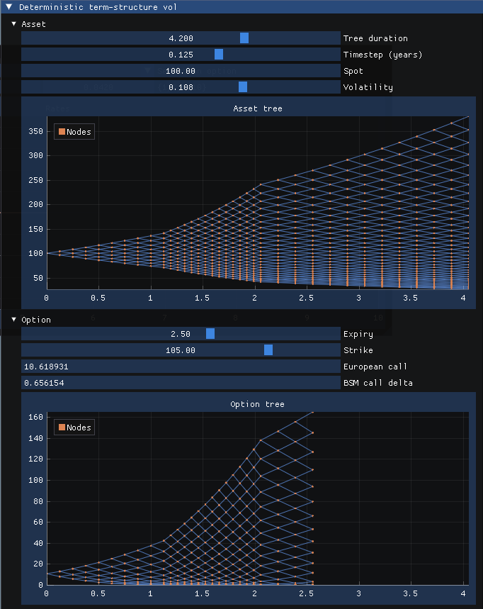
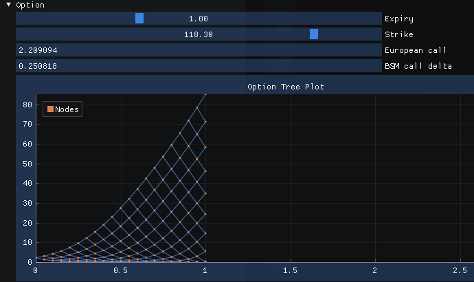
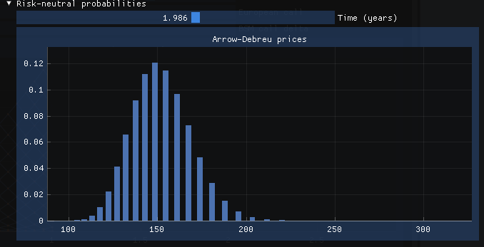
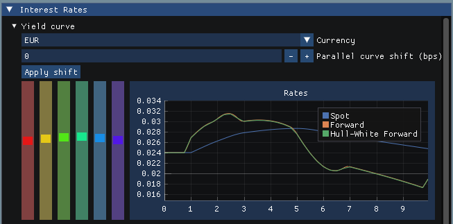
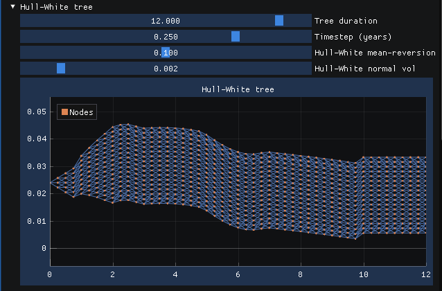

[](https://github.com/phaedon/smile-explorer/actions/workflows/presubmit.yml)
[](https://coveralls.io/github/phaedon/smile-explorer?branch=main)

- [Overview](#overview)
  - [Features](#features)
  - [Roadmap / wish list](#roadmap--wish-list)
  - [Getting started](#getting-started)
- [Binomial trees: A guided tour](#binomial-trees-a-guided-tour)
  - [Yield curves](#yield-curves)
  - [Options](#options)
  - [Currency options and risk-neutral probabilities: A full example](#currency-options-and-risk-neutral-probabilities-a-full-example)
- [Interest rate models with trinomial trees](#interest-rate-models-with-trinomial-trees)
  - [Tree fitting and calibration](#tree-fitting-and-calibration)
  - [Swaps](#swaps)
  - [Options](#options-1)
- [Why?](#why)
- [Sources \& attributions](#sources--attributions)

## Overview

This library is intended to enable to build effective tools for developing deeper intuition into the details of tree-based construction and pricing of derivative securities, and is suitable for both seasoned professionals and students of quantitative finance.

Because this is not intended for production use, some details are omitted. For example, there is no support for country-specific holiday calendars or details about exchange-traded contract specs.

### Features

* **Tree-based models:** Implements binomial trees for accurate derivative pricing.
* **Trinomial trees:** Short-rate tree models based on the Hull-White tree construction method.
* **Volatility Modeling:** Supports constant, term structure, and local volatility surfaces.
* **Option Pricing:** Prices European and American options on assets and currencies.
* **Visualisation:** Provides tools for visualising tree structures and probability distributions.
* **Robustness:** Unit tests are based on many examples from reference texts and are automatically run as presubmits.

### Roadmap / wish list

* Pricing and volatility calibration to interest-rate derivatives (caps/floors/swaptions).
* Improve visualisation capabilities for vol surfaces and interest rate curves. 


### Getting started
Install [Bazel](https://bazel.build/install) and then run:
```shell
# Launch the interactive GUI!
bazel run explorer

# Or just run all the unit tests.
bazel test ...
```

This library, and the `explorer` binary, works on MacOS and Linux. On Ubuntu, you may need to install these graphics libraries because of the dependency on GLFW and OpenGL3:

`sudo apt-get install xorg-dev libgl1-mesa-dev`

(The explorer is not yet supported on Windows, because it uses GLFW, which was recently added to the BCR without Windows support. See the [Bazel build rule here](https://github.com/bazelbuild/bazel-central-registry/blob/main/modules/glfw/3.3.9/patches/add_build_file.patch) for context.)


## Binomial trees: A guided tour

Let's begin with an asset, such as a (zero-dividend) stock. We can immediately build a binomial tree using a constant lognormal volatility as follows:

```c++
Volatility vol(FlatVol(0.12));
double spot_price = 100;
// 5 years, with monthly timesteps:
StochasticTreeModel<CRRPropagator> asset(BinomialTree(5.0, 1/12.),
                                         CRRPropagator(spot_price));
asset.forwardPropagate(vol);                               
```


Notice that no discount rate is provided. So far, we are only modeling the evolution of the asset, without actually trying to value any future cashflows (yet).

What's that template parameter `CRRPropagator`? The propagators allow you to specify *how* exactly the asset evolves forward in time, given a volatility function (which can be a flat constant, or a function with a deterministic term structure).

```c++
struct TermStructureExample {
  static constexpr VolSurfaceFnType type = VolSurfaceFnType::kTermStructure;
  double operator()(double t) const {
    if (t <= 1) return 0.2;
    if (t <= 2) return forwardVol(0, 1, 2, 0.2, 0.255);
    return forwardVol(0, 2, 3, 0.255, 0.311);
  }
};

Volatility vol(TermStructureExample{});
```

There are more examples in the unit tests and the `explorer` code, and you can generate a tree based on a local vol surface, simply by switching out the propagator and providing your custom functor:

```c++
  auto asset_tree = BinomialTree::create(
      std::chrono::months(12), std::chrono::days(10), YearStyle::k360);
  ZeroSpotCurve curve(
      {0.01, 1.0}, {0.04, 0.04}, CompoundingPeriod::kContinuous);
  LocalVolatilityPropagator propagator(curve, 100.0);
  StochasticTreeModel asset(std::move(asset_tree), propagator);
  asset.forwardPropagate(volsmilesurface);
```


One thing we had to add for local vol is a discount curve. The reason is that the method of tree construction requires computing the forward at each time step. As documented in the code, the technique follows the explanation in [*The Volatility Smile and Its Implied Tree*](https://emanuelderman.com/the-volatility-smile-and-its-implied-tree/) (Derman & Kani, 1994).

Finally, the library supports trees with a non-constant term structure. This generates trees with varying timesteps, because of the requirement that the tree is recombinant even though the up/down states change as we move forward in time. Here's an example:




### Yield curves

We take a slight detour into discounting. 

Because this library doesn't yet have short-rate / term-structure models, an initial approximation is provided in the class `ZeroSpotCurve`. Specify a vector of maturities (in years), a matching vector of zero-coupon bond yields, and a
compounding convention. A yield curve is generated, assuming either constant forward rates or an interpolated cubic spline on the zero-coupon rates.

You can then look up a discount factor or forward rate spanning any time period on this curve:

```c++
ZeroSpotCurve zeros(
    {1, 2, 3, 5, 7, 10}, // maturities (in years)
    {0.02, 0.025, 0.03, 0.04, 0.045, 0.048}, // zero rates
    CompoundingPeriod::kAnnual,
    // Or set CurveInterpolationStyle::kMonotonePiecewiseCubicZeros
    CurveInterpolationStyle::kConstantForwards);

// In 1 year for 2 years:
double rate_1x3 = zeros.forwardRate(1.0, 3.0);

// Discount factor at year 4.5:
double df = zeros.df(4.5); 
```

### Options

The natural next step is to use these trees to price some options on the underlying asset. There are several examples of this throughout the explorer code and the unit tests (see in particular `derivative_test.cpp`).

```c++
auto option = Derivative(&asset.binomialTree(), &curve);
double option_price = deriv.price(
    VanillaOption(/* strike= */ 118.3, OptionPayoff::Call, ExerciseStyle::European), 
    1.0); // Expiry (in years)
```

Here's the (backward-induction) tree for the 25-delta call, using a flat discount rate of 5% and a volatility of `sqrt(252)`:




### Currency options and risk-neutral probabilities: A full example

We can model an option on USD-ISK (the Icelandic króna) and look at the implied probability distribution of possible outcomes:

```c++
// Just be sure to pass the curves in the correct sequence!
// See "A Guide to FX Options Quoting Conventions" (Reiswich & Wystup, 2010)
CurrencyDerivative deriv(&usd_isk_tree, &isk_curve, &usd_curve);
double option = deriv.price(
        VanillaOption(
          160, // strike
          OptionPayoff::Call),
        0.5);  // Expiry (in years)

// To grab the probabilities:
const auto states = asset.binomialTree().statesAtTimeIndex(time_index);
const auto probabilities = 
    deriv.arrowDebreuTree().statesAtTimeIndex(time_index);
```

Below is the distribution of (discounted) risk-neutral probabilities (Arrow-Debreu prices) using a constant annualised vol of 8% over 2 years. 

With spot at 140 and an interest-rate differential of around 4%, you can see that the forward is around 150. This is a good visual sanity-check that the two yield curves are correctly handled when pricing derivatives on the exchange rate:



For the full experience, launch the viewer, and change the rates and the other parameters to see the probability histogram update in real time!

## Interest rate models with trinomial trees 

The `TrinomialTree` class is used to build short-rate models. These are essential for pricing interest-rate derivatives such as caps/floors and swaptions.

### Tree fitting and calibration

In the initial implementation, we provide one such model, encapsulated in the `HullWhitePropagator`. This builds a trinomial tree and calibrates it to the yield curve provided:

```c++
auto hullwhitecurve = std::make_unique<ShortRateTreeCurve>(
  std::make_unique<HullWhitePropagator>(
    0.1,          // mean reversion speed
    0.01,         // normal volatility 
    0.25 * 0.1),  // timestep size == 10 timesteps per quarter
    *zero_curve,
    12.);         // tree duration in years
```
This is an example of an input yield curve. The green and orange forward curves are exactly aligned, indicating that the tree representation is correctly fitted to the input rates:



And this shows the resulting trinomial tree:



This image visualises the constructed trinomial tree. The y-axis represents possible short-rate values at each time step. Each node branches forward to three possible values in the next timestep, representing the stochastic evolution of interest rates.

Note that the Hull-White model is based on a normally distributed short-rate process, so rates can go negative. In this screenshot, the timestep is rather large (3 months) for visual clarity, and the input volatility is set quite low so that the tree reflects the contours of the input forwards.

Notice also that the tree stops expanding around year 2. This is a function of the mean-reversion parameter, which "clamps" the width of the tree past a certain point.

### Swaps 

Basic support for single-currency interest rate swaps is provided. A swap is represented internally
as a set of future fixed and expected floating-rate cashflows (conditional on the underlying short-rate process).

```c++
SwapContractDetails contract{
    .direction = SwapDirection::kReceiver,
    .fixed_rate_frequency = CompoundingPeriod::kSemi,
    .floating_rate_frequency = ForwardRateTenor::k3Month,
    .notional_principal = 100.,
    .start_date_years = 0.,
    .end_date_years = 10.0,
    .fixed_rate = .0401};

// Initialise the swap, represented on a matching underlying trinomial tree:
auto swap =
  InterestRateSwap::createFromContract(contract, hullwhitecurve.get());

// Price the expected cashflows on the tree:
swap.price();
```

### Options

An example of a European option on a zero-coupon bond is provided below, adapted from the unit tests:

```c++
// Define a 9-year zero-coupon bond.
FixedCashflowInstrument bond(&hullwhitecurve);
bond.setCashflows({Cashflow{.time_years = 9.0, .amount = 100.}});

// Wrap it in a "swap" for ease of pricing.
auto swap = InterestRateSwap::createBond(std::move(bond));

// Price a 3-year put option struct at 63.
InterestRateDerivative bond_option(&hullwhitecurve, &swap);
bond_option.price(
    VanillaOption(
      63., // strike
      OptionPayoff::Put), 
    3.0);  // option expiry
```

## Why?

While reviewing techniques for building binomial trees to price options and other derivatives, with extensions for time-dependent vol and skew/smile surfaces, I came across Andrej Karpathy's [Yes you should understand backprop](https://karpathy.medium.com/yes-you-should-understand-backprop-e2f06eab496b) (for neural networks) and was inspired to do something similar for tree-based pricing methods.

Or, according to the quote commonly attributed to Richard Feynman: "What I cannot create, I do not understand."


## Sources & attributions

The primary sources for formulas and techniques are:
* Emanuel Derman, **The Volatility Smile**. [Wiley link](https://www.wiley.com/en-be/The+Volatility+Smile-p-9781118959169) 
* John Hull, **Options, Futures, and Other Derivatives** (11th ed.) [Amazon link](https://www.amazon.com/Options-Futures-Other-Derivatives-Global/dp/1292410655)

Much of the section on binomial trees and local volatility is based on Derman, and the section on trinomial trees and short rates is based on Hull.

In addition, a number of unit tests are built on the examples and end-of-chapter exercises in these texts. Where this is the case, I have provided references inline in the code.
